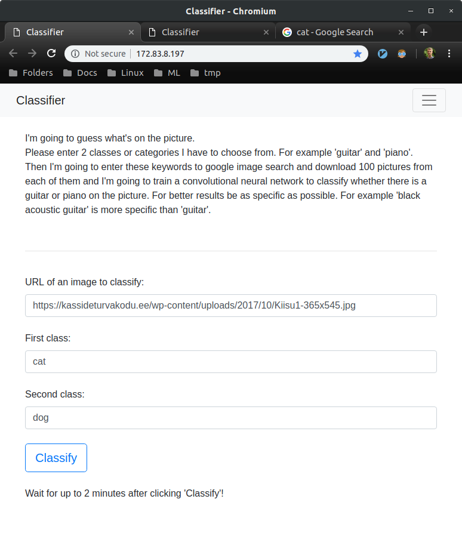
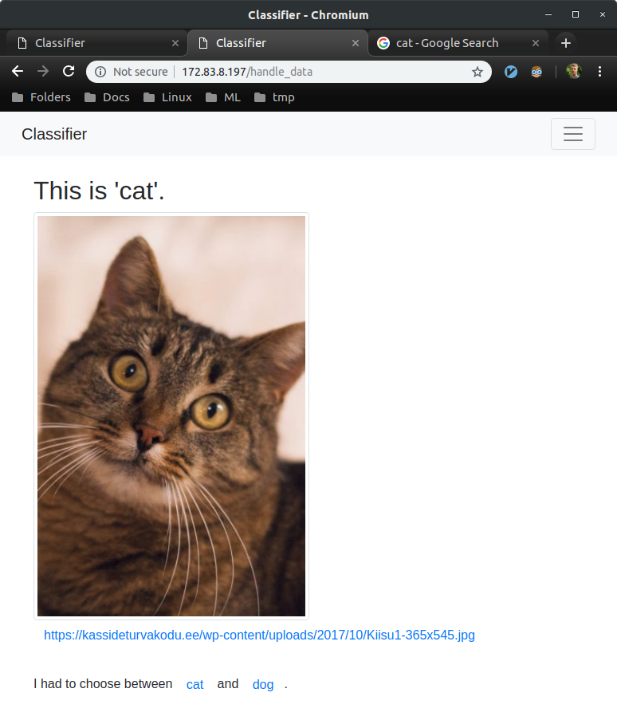

# AGI Classifier

Ok, not really artificial general intelligence (AGI) but the model learns to recognize anything you want from an image.

 

## Background

They say that with Machine Learning you can make predictions without 
explicitly programming it to perform the task. For me, it seems that I 
still need to explicitly build it for the specific task. For example, when I 
made a [collaborative filtering](https://github.com/korjusk/MovieRec) project I
had to:  
collect, clean, analyze, visualize and split the data. Define goal and success, make baseline predictions, build a test, figure out possible complications, choose frameworks and libraries, rent a server with Nvidia GPUs, install and set up everything, build or find a neural network, tune hyperparameters, train it for hours, make a prediction with the trained model.  

I want to automate the process enough that you don't have to write any code for an image classification problem.

 

## Goal

* Learn to deploy a machine learning project
* Learn how to configure the server and related software
* Build a simple classification model that could predict without being 
explicitly programmed

 

## Production  

I deployed my project in [Paperspace](https://www.paperspace.com/).  
It's [cheap](https://www.paperspace.com/pricing), 0.50$/hour + 5$ monthly storage for:
* Quadro P4000 GPU  
* 8 CPU  
* 30GB RAM  
* 50GB SSD  
* Static IP  
* Fast internet  
* Ubuntu 18.04  

The server setup guide is in [setup.md](https://github.com/korjusk/Classifier/blob/master/setup.md).

 

## Result

For example, I have a picture of a pet and I want to know if it's a cat or a dog.

 

#### Let's go to classifier website [172.83.8.197](http://172.83.8.197/)

 

 

#### Enter info and click classify

  

I'm using ResNet-34 architecture that's pretrained with ImageNet. The last layer is trained with ~80 Googled pictures of [cat](https://www.google.com/search?q=cat&tbm=isch&tbm=isch&tbs=isz:m,ic:color) and [dog.](https://www.google.com/search?q=dog&tbm=isch&tbm=isch&tbs=isz:m,ic:color)

 

The same model can be used with multiple classes and multiple target URLs.
And of course, instead of a cat and a dog you could enter whatever you wish. 
For example 'gun', 'knife' and 'hotdog' or 
'professional linkedin profile' and 'linkedin profile'.  

   

### Alternative model hosting sites  

For most of these, you don't get fully configurable Ubuntu server. Instead, you upload your model and it's used only when needed.

* [Render](https://render.com/)  
$5 per month. Flask [quickstart](https://render.com/docs/deploy-flask)

* Amazon [SageMaker](https://aws.amazon.com/sagemaker/)  
[Pricing.](https://aws.amazon.com/sagemaker/pricing/) Python [SDK](https://sagemaker.readthedocs.io/en/stable/) and model deploying [guide.](https://docs.aws.amazon.com/sagemaker/latest/dg/ex1-deploy-model.html)

* AWS [Elastic Beanstalk](https://aws.amazon.com/elasticbeanstalk/)  
[Pricing.](https://aws.amazon.com/elasticbeanstalk/pricing/) Getting [started.](https://aws.amazon.com/elasticbeanstalk/getting-started/)

* Google [App Engine](https://cloud.google.com/appengine/)  
[Pricing.](https://cloud.google.com/appengine/pricing) Python [docs.](https://cloud.google.com/appengine/docs/python/)

 

## Files

* Server setup guide: [setup.md](https://github.com/korjusk/Classifier/blob/master/setup.md)
* Gunicorn config: [gunicorn_config.py](https://github.com/korjusk/Classifier/blob/master/gunicorn/gunicorn_config.py)
* Python code: [flaskproject.py](https://github.com/korjusk/Classifier/blob/master/flaskproject.py) and [wsgi.py](https://github.com/korjusk/Classifier/blob/master/wsgi.py)
* Html code: [index.html](https://github.com/korjusk/Classifier/blob/master/index.html) and [success.html](https://github.com/korjusk/Classifier/blob/master/success.html)
* Bash script: [restarter.sh](https://github.com/korjusk/Classifier/blob/master/restarter.sh)

  

## Accessible

If the website is not accessible then I probably turned it off.
Let me know if you want to use it.

  

## Next step
* Change the interface so It would be possible to enter multiple classes and URL's
* Measure and report performance
