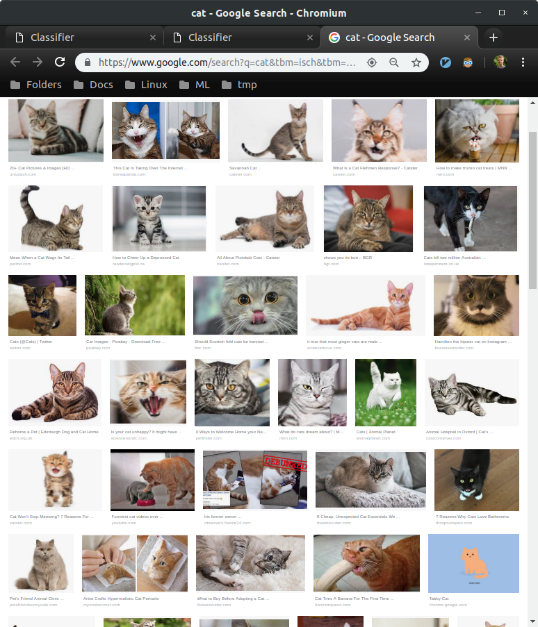

# Classifier

They say that with Machine Learning you can make predictions without 
explicitly programming it to perform the task. For me, it seems that I 
still need to explicitly build it for the specific task. For example, when I 
made a [collaborative filtering](https://github.com/korjusk/MovieRec) project I
had to:
* collect the data
* clean the data
* analyze the data
* visualize the data
* define goal and success
* make baseline predictions
* build test
* figure out possible complications
* choose frameworks and libraries
* rent a server with Nvidia GPUs
* install and set up everything
* build a neural network
* train it for 10h
* make a prediction with the trained model

#### Goal

I want to build a simple classification model that could predict without being 
explicitly programmed to perform.

 

### Example

I have a picture of a cat and I want to know if it's a cat or a dog.

 

#### Let's go to classifier website [172.83.8.197](http://172.83.8.197/)

 

 

#### Enter info and click classify

 

 

#### The model was trained with ~80 Googled pictures like that

 

 

The same model can be used with multiple classes and multiple target URLs.
And of course, instead of a cat and a dog you could enter whatever you wish. 
For example 'gun', 'knife' and 'hotdog' or 
'professional linkedin profile' and 'linkedin profile'.

 

If the website is not accessible then I probably turned it off.
Let me know if you want to use it.
